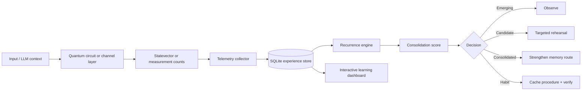

# Neuron

**Neuron** is a runnable quantum cognitive telemetry and learning system for QELM. It records qubit and quantum-channel behavior, LLM execution context, memory retrieval, outcomes, recurrence, and guarded memory consolidation, then turns that activity into an interactive model of learning over time.

This repository implements the idea as software rather than a conceptual mockup.

## What it does

1. **Captures experience traces** from a statevector or hardware counts dictionary.
2. **Calculates per-channel telemetry** such as measurement activation, entropy, coherence proxy, stability, estimated error, and an engineering information score.
3. **Links quantum telemetry to cognition-like context**: concept, LLM model, tokens, memory IDs, pathway, novelty, confidence, quality, corrections, and contradictions.
4. **Stores an append-only learning history** in SQLite.
5. **Finds recurrent high-information channel sets** and scores whether they are emerging, candidates, consolidated pathways, or habits.
6. **Visualizes the system** as a channel co-activation network, learning timeline, information heatmap, concept learning curves, pathway table, and per-experience inspector.
7. **Accepts optional Qiskit circuits** through a small adapter, while keeping the core independent of a quantum SDK.

## The learning loop



## Start the working demo

The repository includes launchers that create a virtual environment, install the dashboard dependency, retain an existing database, and start the local app:

```bash
./run_demo.sh
```

On Windows, double-click `run_demo.bat` or run it from Command Prompt. Manual setup follows.

### macOS / Linux

```bash
cd Neuron
python -m venv .venv
source .venv/bin/activate
pip install -r requirements.txt
neuron --db data/neuron.db seed --runs 280 --qubits 7 --reset
streamlit run app.py
```

### Windows PowerShell

```powershell
cd Neuron
py -m venv .venv
.venv\Scripts\Activate.ps1
pip install -r requirements.txt
neuron --db data/neuron.db seed --runs 280 --qubits 7 --reset
streamlit run app.py
```

The dashboard opens locally. It needs no API key and the demo data never leaves the machine.

## Open the included report immediately

A generated example is included at:

```text
reports/neuron_demo.html
```

It is a self-contained HTML dashboard backed by the included demo database.

## CLI examples

Initialize a database:

```bash
neuron --db data/neuron.db init
```

Record one simulated experience:

```bash
neuron --db data/neuron.db simulate "quantum memory retrieval" \
  --qubits 7 --depth 4 --noise 0.03 --quality 0.84 --confidence 0.80
```

Ingest measurement counts from a real or simulated backend:

```bash
neuron --db data/neuron.db ingest-counts "bell-state observation" \
  --backend "my-quantum-backend" \
  --counts '{"00": 502, "11": 522}' \
  --error-rate 0.02 --quality 0.90
```

Recompute memory consolidation:

```bash
neuron --db data/neuron.db consolidate
```

Generate a portable report:

```bash
neuron --db data/neuron.db report \
  --output reports/neuron_report.html
```

## Use it from Python

```python
from qelm_neuron import (
    ConceptCircuitSimulator,
    ConsolidationEngine,
    QuantumTelemetryCollector,
    TelemetryStore,
)

store = TelemetryStore("data/neuron.db")
simulator = ConceptCircuitSimulator(n_qubits=7)
collector = QuantumTelemetryCollector()

result = simulator.run(
    "quantum memory retrieval",
    repetition_index=12,
    depth=4,
    noise=0.025,
)

trace = collector.capture_statevector(
    result.statevector,
    concept="quantum memory retrieval",
    context="LLM requested long-term memory recall",
    backend=result.backend,
    pathway=[
        "input-encoder",
        "context-router",
        "quantum-layer",
        "memory-index",
        "verification",
        "response-decoder",
    ],
    memory_ids=["M-1042", "M-4911"],
    novelty=0.28,
    confidence=0.86,
    outcome_quality=0.91,
    llm_model="QELM-0.1",
    prompt_tokens=420,
    completion_tokens=190,
    error_rates=0.025,
)

store.insert_experience(trace)
patterns = ConsolidationEngine(store).run()
print(patterns[0])
```

## Qiskit integration

Install the optional dependency:

```bash
pip install -e ".[dashboard,qiskit]"
```

Then trace a circuit:

```python
from qiskit import QuantumCircuit

from qelm_neuron import QuantumTelemetryCollector, TelemetryStore
from qelm_neuron.adapters.qiskit_adapter import trace_circuit_statevector

circuit = QuantumCircuit(2)
circuit.h(0)
circuit.cx(0, 1)

collector = QuantumTelemetryCollector()
trace = trace_circuit_statevector(
    circuit,
    collector,
    concept="bell-state memory route",
    confidence=0.88,
    outcome_quality=0.93,
)

TelemetryStore("data/neuron.db").insert_experience(trace)
```

For hardware results, pass a counts dictionary to `trace_hardware_counts` or the `ingest-counts` CLI command.

## Consolidation logic

A frequent pathway is **not automatically learned**. The score combines:

- recurrence;
- outcome quality;
- confidence;
- channel stability;
- memory retrieval presence;
- novelty;
- correction importance;
- contradiction penalty;
- estimated error/noise penalty.

The result maps to one of four states:

| State | Meaning | Default action |
|---|---|---|
| `emerging` | Too early or too weak | Observe without behavior change |
| `candidate` | Worth continued rehearsal | Collect more evidence |
| `consolidated` | Stable and useful | Strengthen and reuse the memory route |
| `habit` | Repeated, high-quality, stable | Cache the procedure, but retain fast verification |

The thresholds are deliberately configurable in `ConsolidationConfig`.

## Project structure

```text
app.py                                Streamlit dashboard
qelm_neuron/models.py             Telemetry and pattern models
qelm_neuron/metrics.py            Quantum/channel metrics
qelm_neuron/simulator.py          Small NumPy statevector simulator
qelm_neuron/telemetry.py          Statevector and counts collectors
qelm_neuron/store.py              SQLite persistence
qelm_neuron/consolidation.py      Recurrence and habit engine
qelm_neuron/visualization.py      Network charts and HTML report
qelm_neuron/adapters/              Optional backend adapters
qelm_neuron/cli.py                Command-line interface
tests/                                Unit and integration tests
docs/ARCHITECTURE.md                  Design, schema, and extension points
docs/METRICS.md                       Metric formulas and interpretation limits
docs/INTEGRATION.md                   Backend and LLM integration guide
```

## Scientific and engineering boundaries

This prototype is an observability and learning architecture, not evidence that a quantum computer is literally a brain.

- The `information` field is a bounded engineering score, not a universal measure of semantic information.
- Single-qubit measurement entropy does not reveal what a concept “means.” Meaning comes from the surrounding task, model, route, memory, and outcome labels.
- Pairwise computational-basis mutual information can reveal correlated measurement behavior, but it is not automatically an entanglement measure.
- Counts from one measurement basis cannot recover coherence; the counts collector records coherence as unavailable/zero.
- The included NumPy simulator creates useful test telemetry but does not model every physical noise process and does not claim quantum advantage.
- Habit execution should always retain verification, rollback, audit history, and contradiction checks.

## Tests

```bash
python -m unittest discover -s tests -v
```
